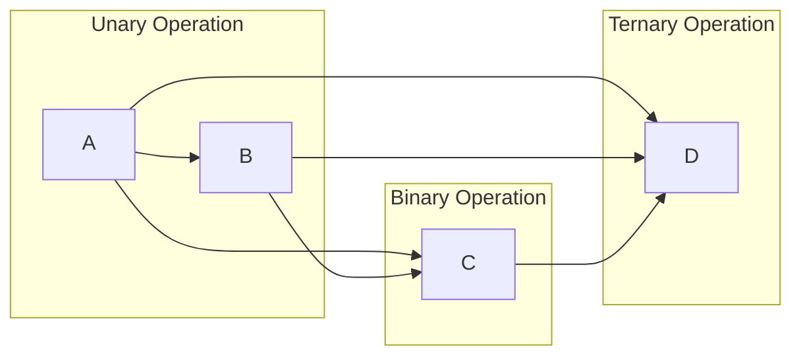
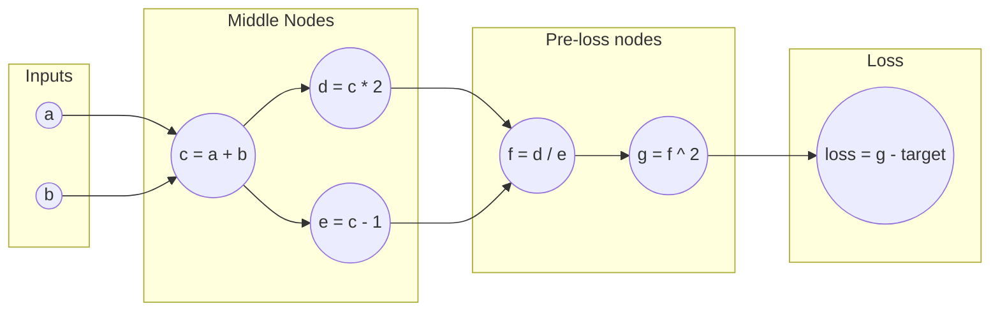

The other day I started watching the [_Zero to Hero_ series from Andrej Karpathy](https://www.youtube.com/playlist?list=PLAqhIrjkxbuWI23v9cThsA9GvCAUhRvKZ). Specifically the first chapter that explains the [Backprop algorithm](https://en.wikipedia.org/wiki/Backpropagation). 
Backpropagation (backprop) isn't too complex itself, it is all about finding how much each parameter contributes to the error (loss). That is all the partial derivatives of the loss wrt[^wrt] each parameter. And the math behind it is just the chain rule over and over again. But there is more to it and I think it is pretty cool.

In Pytorch we often just take it for granted, we don't really get to see what is happening behind the scenes when we write `loss.backward()`

The thing is, how does it look in an actual implementation? Do you create a data structure to store the *autograd graph* to keep track of the relationships between variables? Are the derivatives stored in that data structure or somewhere else? Are they computed numerically in an operator-agnostic manner (which would be too computationally expensive at scale)? Or do you specify them somehow?

Well, turns out things get a lot simpler if we treat each value as an object. OOP to the rescue here!

You could define a `Value class` with the following attributes in the constructor:

> Karpathy's approach is with scalars for simplicity, so take that in mind, here I will be having a look at some snippets from his code.
{: .prompt-info }

```python
def __init__(self, data, _children=()):
        #The actual value
        self.data = data
        #The val of the derivative of the loss wrt this value
        self.grad = 0
        #Internal variables used for autograd graph construction
        self._backward = lambda: None
        self._prev = set(_children)
```
{: .nolineno }

We can just make every value (output of an operation) keep track of where it came from (operands) within the tuple `_children` (notice tuples are unordered). The only values without children would be the input of our network (or function in general).

> The name children could be confusing because it depends on which direction of the pass you are considering. Since we are interested in Backprop, we are referring to children in the backward pass (which are the parents in the forward pass). So in $a+b = c$, $a$ and $b$ are the children of $c$.
{: .prompt-info }

Each operation ($+,-,\cdot,tanh()\dots$) will be a **method** of our Value class and have its own `_backward` implementation. Let's have a look for example at the multiplication method (overloaded to use the \* notation):

```python
def __mul__(self, other):
        #Casting to Value type
        other = other if isinstance(other, Value) else Value(other)
        #Result of the operation as a Value object
        out = Value(self.data * other.data, (self, other), '*')
        
        def _backward():
            self.grad += other.data * out.grad
            other.grad += self.data * out.grad
        out._backward = _backward

        return out
```
{: .nolineno }

> The use of `+=` instead of just `=` comes from the problem of having a binary operation where the 2 operands are the same. For example $a*a$ or $a+a$, the derivatives should be added in these cases.

What `_backward()` does is setting the value of the __derivatives (`.grad`) of the operands__ (self and other) which __depend on the value of the derivative of the output__ (due to the **chain rule!**). Therefore we need the value of the derivative of the result before we call this method on the operands! (That is why it is a backward pass, we call it from the loss to the input).

> The derivative of the loss wrt[^wrt] itself is one, and from there we start recursive calls.

Now what is left to do is make sure the backward calls are done in the proper order so that we don't require a value that doesn't exist yet. And here is what I found to be the most fascinating idea of the lecture:

> The autograd graph is **Directed Acyclic Graph (DAG)** and we can use a Topological Sort to get a linear ordering in which to compute the derivatives!!!
{: .prompt-tip }

And for those who did not understand what this means (I didn't without a few searches), there is a beautiful short explanation in [geeksforgeeks](https://www.geeksforgeeks.org/topological-sorting/) that I will try to synthesize here.

First things first, what is a DAG?:
- Directed means that each edge of the graph has a direction
- Acyclic means that there are no loops (cycles) in the graph. There is no path to get back to any initial vertex.

> From a quick glimpse it might seem that a unary operator would be an edge that points to its initial node and so that would break the acyclic property. But that is not the case. Unary, binary, ternary, etc. only refer to how many edges are pointing into the output node. Input and output nodes are always different nodes in our autograd graph (and different objects in our code):



Now, what is a Topological Sort then? Well, I like to think of the DAG as a hierarchy according to the number of operations (or edges to cross) needed before getting to a certain node. So that the top of the hierarchy would be the input (there are $0$ operations before getting to that node) and the bottom would be the loss function (you have to do all the $n$ operations of the network to get there). Then, a Topological Sort is just any linear ordering that respects that hierarchy (from higher first to lower after).

Let's take a look at a possible network diagram to exemplify this concept:

>_The top of the hierarchy would be $a$ and $b$ (0 operations) then $c$ (1 operation), then $d$ and $e$ (2 operations), then $f$ (3 operations), then $g$ (4 operations) and finally the loss (5 operations)._

Notice that a linear ordering that respects this hierarchy is not unique. Higher hierarchy goes first, but nodes within the same hierarchy can be permuted, for example these 3 linear orderings would all be a Topological Sort of the previous DAG:

$$ [a,b,c,d,e,f,g,loss]$$

$$ [b,a,c,d,e,f,g,loss]$$

$$ [b,a,c,e,d,f,g,loss]$$


Finally, we want to get our ordering for computing the derivatives during the backward pass, but we said we had to start from the loss, so our actual ordering will be the **reverse of the topological sort** (that means from lower hierarchy to higher hierarchy or "*from more operations to less operations*").

>This idea of *from lower hierarchy to higher hierarchy* translates into visiting any output before visiting their operands, since the output always belongs to a lower hierarchy than the operands that produced it.
{: .prompt-tip }

The code implementation of this is inside the `.backward()` method of the Value class. Notice that the children are stored in a tuple, so they don't have a specific order but that is not a problem for the topological sort since all children have the same hierarchy level. Also, the method could be called from any node and we would be computing the derivatives wrt[^wrt] to that node but in practice this is only used wrt[^wrt] the loss.

> Don't let the naming convention fool you! `.backward()` is a method of the Value class and `._backward` is an attribute of the Value class that can be called because it stores a function object. 
{: .prompt-info }

> With the underscore (see the code above) we are setting the value of the derivate of the operands using the value of the derivative of the result.

> Without the underscore we start the backprop algorithm to get all the derivatives of that Value (the one that calls the method) wrt[^wrt] each other variable it depends on: compute the ordering list (topological sort of the DAG) and call `._backward()` on each Value according to that order.


```python
def backward(self):
        # topological sort the DAG using the _prev attribute 
        # that stores the children
        topo = []
        visited = set()
        def build_topo(v):
                if v not in visited:
                visited.add(v)
                for child in v._prev:
                        build_topo(child)
                topo.append(v)
        build_topo(self)

        # set the grad wrt itself
        self.grad = 1
        # go recursively setting the grads in the correct ordering
        for v in reversed(topo):
                v._backward()
```
{: .nolineno }

> About the Topological Sort code: we are using recursion and notice that before appending anything to `topo` we are calling the function on every children. That means that we won't get to the append line until every children has run the `build_topo` function. Therefore until every children is appended to `topo`! And that is true for every value of the graph. The behavior is that all the function calls are being stacked one on top of the other and nothing is appended until we reach the inputs (that have no children). Then there is a cascade of functions that finish execution in the desired order. This way children (operands) appear always in the list before their parents (outputs). Just remember to take the reverse before computing the derivatives or the code will complaint.

If you're interested in seeing a complete implementation of the Value class with more operators, and how it can be used to build layers and a neural network, check out the [micrograd GitHub repository](https://github.com/karpathy/micrograd).  The entire implementation is surprisingly concise (around a 160 lines). As Andrej Karpathy puts it, the remaining code in PyTorch for Backprop is basically about efficiency and handling tensors instead of scalars.


[^wrt]: *wrt* is short for "with respect to"
