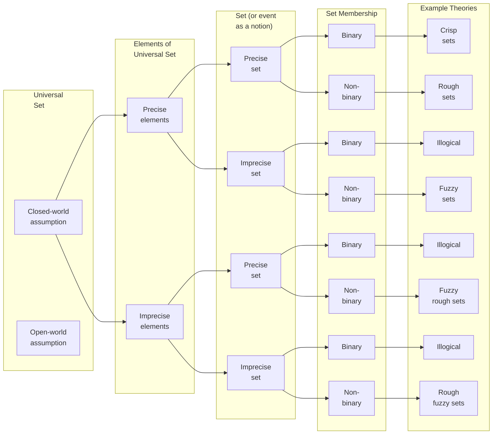

## Some history

Set theory, the basis for all mathematics. But what is a set? According to Cantor, it's *a collection of any objects, which, according to some law, can be considered as a whole*. 

Sets are not only used for math stuff. We are constantly grouping concepts using sets whether we know it or not. Like all thumbs are fingers, but not all fingers are thumbs. So it is <u>intrinsically related to how we process information</u> and find shared characteristics across different elements.

But the  **intuitive set theory** proposed by Cantor had its limitations (contradictions could be defined) and was a big deal at the beginning of the last century, leading to **axiomatic set theories**: Axiomatic Set Theory (Zermelo-Fraenkel, 1904), Theory of Types (Whitehead and Russell, 1910), Theory of Classes (von Neumann, 1920).

> A famous contradiction that arose from Cantor's proposal is Russell's paradox: If you consider R the set of all sets that are not members of themselves, then we have two cases:
>   - If $R\in R$, but then R is a member of itself, so it contradicts the condition and should not be in R.
>   - If $R\notin R$, but then R is not a member of itself, so it satisfies the condition and should be in R.
> 
> This is a consequence of only having two possibilities: belonging to a set or not belonging. In the end, what mathematicians did was to say there is no paradox because R is not a set, it is a class and we are safe and sound, math works. (Classes are like a "more permissive set" that may lead to crazy behavior like this, they have nothing to do with equivalence classes).
{: .prompt-tip }

In Classical (or Crisp) Set Theory, a set is uniquely determined by its elements. So an element is either in a set or not. This has important implications for logic because it means that **a statement is either true or false** (which is a huge assumption, especially given the existence of unprovable statements in the axiomatic systems we want to use in mathematics[^Godel]). Nevertheless, **this dichotomy is a must for most mathematics, since without it, we wouldn't be able to reason precisely**.

## Vagueness & uncertainty

As always, reality is more complex than our model of *spherical incompressible homogeneous uniformly distributed identical cows* (although it would be pretty cool otherwise). So today I am here to talk about **uncertainty and vagueness**. This used to be relevant only for philosophers, but nowadays it also is for reasoning systems, robotics, interpretable algorithms, decision-making problems...

> When we say vagueness, we mean *imprecise notions*. I hope later examples will clarify this concept :)
{: .prompt-info }

Contrary to what you might be thinking, the source of vagueness isn't just us being lazy when describing something, but it's the nature of some concepts that cannot be easily quantified. For example, "tall", "expensive", "close", "good", "tasty", "healthy" are all vague concepts.

Regarding mathematics for modeling uncertainty and information synthesis, the most well-known framework (but not the only one) is **probability theory** (upon which statistics are built). It relies on *Crisp Sets* (more specifically on a $\sigma$-algebra) and a *Classical Measure*. So here is the first distinction:

- **Set Theory** provides a formal way to <u>encode data and express information</u>.
- **Measure Theory** defines the <u>notion of metric</u> (assigns a number to a subset). If it satisfies certain properties, it is then a probability measure. 

In this post, we will focus only on generalizations of Crisp Sets, not generalizations of Classical Measures (that is a beautiful topic for another day).

> Classical Measures can be generalized by relaxing the additivity property, asking only for monotonicity.
> 
> The additivity property in probability is $P(\bigcup_{n=1}^\infty A_n) = \sum_{n=1}^\infty P(A_n)$ for pairwise disjoint events $A_n$.
{: .prompt-tip }

## Motivation

Let's illustrate the utility of generalizing set theory with some examples and have a look at the big-picture classification before diving into each framework's formulation. For this purpose, here are a few concepts:

- **Universal Set:** The totality of all the things that exist pertaining to the domain of interest. It is the set of all objects or elements considered in a problem or a system.
  - <u>Closed-world</u> implies assuming it is complete and known with absolute certainty. What isn't considered here doesn't exist in our model.
  - <u>Open-world</u> assumes the universal set may be incomplete.  We **won't consider this here**.
- **Elements of the Universal Set:** All the objects of interest that can be defined: precisely (unique) or imprecisely (not unique). For example, let's take the universal set of all registered vehicles in Spain:
  - <u>Precise element:</u> The vehicle with the registration number 1234ABC. (A specific, uniquely identifiable, registered vehicle.)
  - <u>Imprecise element:</u> A red car. (Many vehicles could satisfy this vague description, but we might not have more information than this.)
- **Set or an event:** A collection of elements from a universal set of interest. Can again be defined either precisely or imprecisely, which makes reference to the objective or subjective nature of the criteria.
  - <u>Precise set:</u> The set of all vehicles registered in Madrid. (Clear, specific, objective criteria.)
  - <u>Imprecise set:</u> The set of expensive cars. (Vague criteria, depends on context and interpretation.)
- **Set Membership:** This is also related to how the criteria for belonging to a set are satisfied, leading to binary or non-binary classifications.
  - <u>Binary:</u> An element either belongs or does not belong to a set. (e.g., A car is either registered in Madrid or not)
  - <u>Non-binary:</u> An element can belong to a set with a certain degree or grade of membership (e.g.,  It doesn't make sense to state that a $100\, 000$€ car is expensive and a $99\,999$€ car is not expensive).

The following diagram (Figure 2.1 in the book[^book]) illustrates these concepts with example theories for each case (they are possible models, but might not be the only way to do it).

## Crisp Sets

As we can see in the diagram, Classical Sets have the following assumptions:
- Precise element definitions.
- Precise set criteria.
- Binary membership function: an object belongs to a set or not, and that is all.
  
These lead to the construction of *"Boolean Logic"* (black and white thinking), which is quite a powerful framework, but in real life, we want to handle lots of gray areas.

> Note that fuzzy sets, rough sets, and other similar generalizations encompass a class of approaches with shared formal foundations but diverse implementations, rather than adhering to a single, rigid definition. For example, fuzzy sets can be intuitionistic, hesitant, multi-polar, bipolar, picture, type-1, type-2...
{: .prompt-warning }

## Fuzzy sets
Fuzzy sets were introduced by Lotfi A. Zadeh in 1965. They accept the assumptions:

- Precise element definitions.
- Imprecise set criteria (gradient of membership).
- Partial membership: degree of membership in [0, 1], rather than crisp {0, 1}.  For example, "tall" is a spectrum, not a binary classification.  Crisp sets are a special case where all memberships are 0 or 1.

> **Where does the membership value come from?** It's a hot topic. But being arbitrary isn't necessarily a bad thing, for example in decision making, the fact that the expert can steer the model with its knowledge might be an advantage. Or we could use a neural network to fine-tune those values optimizing some policy. However, continuity gives us the assurance that small variations of the membership degree will give us small variations in the outcome. Then, I guess getting pretty close is good enough? I'm still having internal conflicts with this myself, so definitely more to learn here.
{: .prompt-info }

There is A LOT of theory that can be built upon this idea: generalizations of union and intersection with T-Norms and T-Conorms, fuzzy numbers with fuzzy arithmetic, fuzzy implications... I'm not getting into that because then I would be writing a whole book, not a post. But I do encourage you to read about it, it's really awesome.

A very common application of fuzzy sets is representing *linguistic terms* using fuzzy numbers. Have a look at the following plot that shows how we could represent "slow", "medium speed" and "fast" using Fuzzy Numbers:

### Healthy people toy-example:

- **Precise elements:** Characterized by weight (in kg) and age (in years).

- **Imprecise set:** We will use vague rules like saying that young people in their ideal weight belong to the healthy set. For this, we have to get a fuzzy representation of what *young* and *ideal* means, for example using fuzzy numbers. Like under 20 years is 100% young (1 membership), over 70 years is 0% young (0 membership) and anything in between is a decreasing function. This is arbitrary and can be based on the doctor's criteria for example (subjective).

- **Non-binary membership:** The outcome of our inference will be a membership degree from 0 to 1, resulting from the aggregation of the membership degrees of *young* and *ideal*.

## Rough sets

Rough set theory was developed by Zdzisław I. Pawlak in the early 1980's with the following assumptions:

- Precise element definitions.
- Precise set criteria.
- Non-binary membership function.

The primary motivation for rough sets is to <u>address inconsistencies and incompleteness in a dataset.</u> Conceptually, rough sets can be viewed as **crisp sets with limited resolution, employing a representation based on a partition of the universal space**.

Rough sets, unlike fuzzy sets which employ blurry boundaries, define crisp boundaries for set membership.  These boundaries delineate:

  - The **lower approximation**: What we definitively know is within the set.
  - The **upper approximation**: What could possibly be in the set. Or what is the same, leaving out what we definitively know is *not* within the set.

Elements falling between  these crisp boundaries (out of the lower and inside the upper) reside in the **boundary region**, a gray area where membership is uncertain due to insufficient information (elements might or might not belong). A rough set with an empty boundary region is equivalent to a crisp set. Crisp sets are a special case like before!

To handle **new data points**, we partition the data space into equivalence classes.  Each class groups similar data points from the reference set.  Any new data point is then assigned to the class it most closely resembles, linking it to existing knowledge. This partitioning forms the basis for determining set membership.

You can also see <u>how good attributes are for evaluating the decision variable.</u> The rougher the set is (the bigger the boundary region is), the worse our attributes are for describing the decision variable and vice versa. This seems intuitively right: if our attributes are good for describing our data, they will help us distinguish if elements belong to our set or not.

> **Rough sets handle inconsistency and incompleteness in a reference dataset through their boundary region**.  Inconsistencies arise when elements within the same class (sharing identical attributes) have different outcomes. Incompleteness suggests that additional attributes could refine the classification, shrinking the boundary region and improving certainty.
{: .prompt-info }

> **Rough sets can also be characterized by a membership function**.  Elements within the lower approximation have a membership of 1, indicating definite inclusion. Elements in the boundary region have a membership between 0 and 1, reflecting the uncertainty of their belonging. Finally, elements outside the upper approximation have a membership of 0, signifying definite exclusion.  
> 
> Formally, given a set $X$ and its lower and upper approximations $\underline{X}$ and $\overline{X}$ respectively, the rough membership function $\mu_X: U \rightarrow [0, 1]$ is defined as:
> 
> $$
> \mu_X(x) = 
> \begin{cases}
> 1, & \text{if } x \in \underline{X} \\
> \frac{|\underline{X} \cap [x]|}{|[x]|}, & \text{if } x \in \overline{X} \setminus \underline{X} \\
> 0, & \text{if } x \notin \overline{X}
> \end{cases}
> $$
> 
> where $U$ is the universe, $[x]$ denotes the equivalence class of $x$, and $\|\cdot \|$ represents the cardinality of a set.
{: .prompt-tip }

In the following plot, the axis are the 2 attributes used to represent data, we have a grid of equivalence classes (partition of the universe), stars that represent data points, a red rectangle (lower approximation) and a green rectangle (upper approximation). The ellipse represents a crisp set we are approximating.

### Healthy people toy-example:

Imagine we have a reference dataset with the weight and the age of people and doctors who evaluated that people and said whether they were healthy or not. Then we would like to use the information from that dataset to infer if new people (new data points) belong to the healthy set or not. 

Notice that the new people will very likely have a weight and age combination that is not represented in our reference dataset. To solve this, we will consider equivalence classes to group all the reference data points so that any new data point will belong to one of those classes that will have at least another data point from the reference. For example we could consider weights between 50 and 55 to belong to the same class and similar for age.

- **Precise elements:** Characterized by weight (in kg) and age (in years).
  
- **Precise set:** We will define our lower approximation by taking all the classes were all the people in that class was said to be healthy, and the upper approximation will be all the classes were at least one person was said to be healthy. So our boundary region is the set of classes with some people who were healthy and some people who were not. 
  
- **Non-binary membership:** A new data point's health status depends on its location:
  - Lower approximation: healthy.
  - Boundary region: might or might not be healthy.
  - Outside the upper approximation: not healthy.

> Our conclusions are as true as the reference data we have.
{: .prompt-warning }

## Hybrid approach

We can combine both rough sets and fuzzy sets approach to get the best of both worlds (hopefully). In these cases, elements will be vaguely defined using fuzzy attributes. The only difference is whether the underlying set and its upper and lower approximations are crisp sets (Rough-Fuzzy Sets) or fuzzy sets as well (Fuzzy-Rough Sets).

>The distinction made in the book[^book] between **rough fuzzy sets** and **fuzzy rough sets** doesn't seem to be universally adopted, most sources call them all just fuzzy rough sets without the distinction we are making here. But from a epistemological point of view, I think it is still interesting to differentiate them.
{: .prompt-warning }

>I came up with these examples myself, so there might be some inaccuracies. As mentioned, I haven't found a good reference for this approach, so please take them with a pinch of salt. Suggestions are welcome!
{: .prompt-warning }

### Rough-Fuzzy sets with the healthy people toy-example:

- **Imprecise elements:** Characterized by fuzzy attributes representing weight and age. For instance, "weight" could be represented by fuzzy sets like "Light", "Average", and "Heavy", each with associated membership functions. Similarly, "age" could be represented by fuzzy sets like "Young", "Middle-aged", and "Senior".  Each person would have a degree of membership to each fuzzy set (e.g., a person could have a 0.8 membership in "Average" weight, a 0.2 membership in "Heavy" weight, and a 0 membership in "Light" weight).

  - It is not that we have 50kg and say this is 0.8 average and 0.2 light. It is that we only know it is 0.8 average and 0.2 light. For example. imagine we had several doctors evaluate a person and classify it into those 3 categories and the membership is the proportion of doctors that chose each category for that person. I know, for a weight attribute this is strange because we can measure it numerically, but for other variables that is not possible. Just wanted to keep the same kind of example for easier comparison.

- **Precise set:** The "healthy" set is a crisp set (healthy or not healthy). So we know if our reference elements are either healthy or not. Consider each specific combination of fuzzy weight and age categories (e.g., "Average" weight and "Middle-aged"); these combinations are our equivalence classes (notice that in this case, one data point might belong to more than one class, due to the imprecise definition of elements). For each person, we determine their membership degrees to each class by aggregating (e.g., taking the product) the memberships of their fuzzy attributes.

  - **Membership to Equivalence Classes:** We introduce a threshold α (e.g., 0.2) to determine significant membership to an equivalence class. A person is considered a member of an equivalence class if their combined membership degree is greater than or equal to α (this is called defuzzification).

  - **Lower Approximation:** The lower approximation of the "healthy" set includes all classes where the *all* the individuals are healthy.

  - **Upper Approximation:** The upper approximation includes all classes where the *at least one* individual is healthy.

  - **Boundary Region:** The difference between the upper and lower approximations. It consists of classes with a mix of healthy and unhealthy individuals.
  
- **Non-binary membership:** A new individual will have a degree of membership to each equivalence class. They are considered a member of a class if their membership degree is greater than or equal to α. Then classification is the same as with Rough sets.

### Fuzzy-Rough sets with the healthy people toy-example:

- **Imprecise elements:**  The same fuzzy attributes are used as in the Rough-Fuzzy case.

- **Imprecise set:** Unlike Rough-Fuzzy where "healthy" is a crisp set, in Fuzzy-Rough, "healthy" is a *fuzzy* set. So the reference data is not healthy or unhealthy, but a "healthiness degree" (membership degree to the "healthy" set). We know the healthiness of the reference data and want to compute the healthiness of the new data.
  
  - **Fuzzy Approximations:**  Equivalence classes are defined as in Rough-Fuzzy. However, instead of crisp lower and upper approximations, we have *fuzzy* approximations. For each class *C*:
    - `μ_lower(C)`: Minimum healthiness degree among reference individuals belonging to *C*.
    - `μ_upper(C)`: Maximum healthiness degree among reference individuals belonging to *C*.

- **Non-binary membership:** A new individual's healthiness degree is calculated by aggregating (e.g., using a weighted average) their membership degrees to the classes, weighted by the classes' fuzzy lower and upper approximation memberships. This contrasts with Rough-Fuzzy, where the new individual's health status is determined based on whether the classes they belong to fall within the crisp lower/upper approximations.

## Final thoughts

Consider this post a gentle introduction. There are tons of variations and improvements we could make to these examples, but I hope you've learned something new and grasped the main ideas of a topic rarely mentioned in undergrad programs.

I'm still learning about the topic and will most likely keep posting about this in future, stay tuned on my linkedin for updates! If you have any questions or just want to chat about this, don't think it twice and reach out :)

## References & Recommendations

- For a great overview without getting too many details: **Uncertainty Modeling and Analysis in Engineering and the Sciences** by *Bilal M. Ayyub* and *George J. Klir*.
  - The authors start with the philosophical foundations of the concepts of knowledge and ignorance to then present (very briefly) frameworks in a well-structured approach.
- **Rough Sets** by *Zdzisław Pawlak*.
- Books from *Robert Fullér* are great for building a good intuition about Fuzzy Sets. The one I am reading is **Introduction to Neuro-Fuzzy Systems**, which also explains the relation with Neural Networks. It was published in 2000, but I'd say it is still very relevant.

#### Footnotes:

[^book]: **Uncertainty Modeling and Analysis in Engineering and the Sciences** by *Bilal M. Ayyub* and *George J. Klir*

[^Godel]: Gödel's incompleteness theorems demonstrate that some true statements are unprovable within any formal system of arithmetic.
